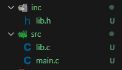
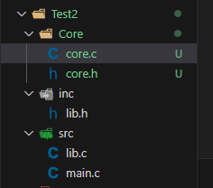

# Learn  MakeFile

# Chạy main.c với folder 1 file .c
```bash
gcc main.c -o main.exe 
cmd: main.exe  
MYNGW64: ./mainexe  
```

# Chạy folder có nhiêu file .c .h
Cách 1: 
```bash
gcc -c main.c  -o main.o
gcc  -c lib.c -o lib.o
gcc main.o lib.o -o main.exe
 ./mainexe  
```
trong đó:  
'-c' là tạo các file object  
'-o' là tạo ra file output  


Cách 2: Gộp các lệnh  ở cách 1 bằng việc dùng '-i'  
```bash
gcc main.c lib.c -o main.exe -I.
 ./mainexe  
```

# Makefile đầu tiên
Tạo 1 file "Makefile"  
```bash
main:
	gcc main.c lib.c -o main.exe -I.
```
Cách chạy   
```bash
make main
```

# Rule MakeFile
\

# Biến trong makeFile
Được khởi tạo:   
```bash
NAME = VALUE
```
Được call:  
```bash
${NAME} hoặc $(NAME) 
```
# Một vài ký tự trong MAKEFILE cần nhớ wildcarrds, automatic variable  
 ## %.o  %.c  pattern đại diện cho file có phần tên bất kỳ, phần mở rộng .c hoặc .o.  
Ví dụ:
```bash
%.o: %.c
	gcc -c $< -o $@
```
Nghĩa là: “Muốn tạo file .o từ file .c có cùng tên phần đầu, chạy lệnh bên dưới”.

## Automatic variables  
```bash
$@: tên của target hiện tại (file đích)  
$<:  tên của file phụ thuộc đầu tiên (first prerequisite)  
$^ — tất cả các file phụ thuộc (all prerequisites), không trùng lặp  
```
Ví dụ minh họa:  
```bash
main.o: main.c
	gcc -c main.c -o main.o
```
Có thể viết ngắn gọn với pattern và automatic variables:  
```bash
%.o: %.c
	gcc -c $< -o $@
```
Ở đây:  
* Nếu target là main.o, thì $@ = main.o  
* File nguồn đầu tiên $< = main.c  


# PHONY
Khi target trung tên file, vd có lệnh:  
```bash
clean:
	rm -f *.exe *.o
```
Và có file 'clean' thì sẽ cho kết quả: 
```bash
make : 'clean' is up to date.
```
ta sẽ sửa makeflie thành:   
```bash
.PHONY: clean
clean:
	rm -f *.exe *.o
```  
Một số chuẩn PHONY hay dùng 
```bash
| Target    | Chức năng                                                      |
|-----------|----------------------------------------------------------------|
| all       | Thực hiện build toàn bộ                                        |
| install   | Tạo bản cài đặt của ứng dụng từ việc compile binary            |
| clean     | Xóa binary file được tạo từ source                             |
| distclean | Xóa tất cả các file được tạo ra mà không nằm trong source chính |
| TAGS      | Tạo bảng tag để editor dùng                                   |
| info      | Tạo GNU info file từ textinfo source                          |
| check     | Chạy bất kỳ test nào tương ứng với chương trình               |
| build     | Biên dịch hoặc xây dựng project               				|
| run	    | Chạy chương trình								             	|
```  

# VPATH và CFLAGS trong Makefile
từ trước tới giờ các file .c .h đang để trong cùng 1 thư mục nên thao tác rát đơn giản.  
Khi để các file .c trong 1 folder và các file .h trong 1 folder  
Giải pháp là:  
```bash
CFLAGS= I inc
VPATH = src
``` 

Viết vào trong Makefile

# FOREACH trong makefile 
 Nếu có nhiều folder chứa file .h nhiều folder chứa file .c thì làm như nào.    
 Đây là lúc chúng ta dùng FOREACH: 
```bash
$(foreach var, list, text)
``` 
trong đó:  
* var là biến tạm lưu phần tử trong list trong mỗi vòng lặp
* list: danh sách các phần tử mà bạn muốn lặp qua
* text: Phần tử hoặc biểu thức cần thực hiện với mỗi phần tử trong list  
```bash
CC      := gcc

INC_DIR := ./inc ./core
SRC_DIR := ./src ./core

CFLAGS  := $(foreach d, $(INC_DIR), -I$(d))

VPATH   := $(foreach d, $(SRC_DIR), $(d))

%.o : %.c
	$(CC) -c $(CFLAGS) $< -o $@

all: main.o lib.o core.o
	$(CC) main.o lib.o core.o -o main.exe
.PHONY: clean all
clean:
	rm -f *.o *.exe

``` 

Giải thích:  
* foreach src, $(CORE_SRCS), $(src:.c=.o) nghĩa là duyệt qua từng file trong CORE_SRCS, chuyển phần mở rộng .c thành .o.

* Tương tự cho SRC_SRCS.

* Cuối cùng gom lại thành biến OBJS để biên dịch và link.   


# Automatic Variable

```bash
Tham khảo chính thức: [GNU Make Manual – Automatic Variables](https://www.gnu.org/software/make/manual/html_node/Automatic-Variables.html)

## Biến chính

| Biến |  Ý nghĩa |  Ví dụ |
|:--:|:--|:--|
| `$@` | Tên **target** hiện tại đang được thực thi. | `gcc -o $@ $^` → `gcc -o main main.o utils.o` |
| `$%` | Khi target là **archive member** (vd: `lib.a(member.o)`), đây là tên thành viên (`member.o`). | `ar rcs $@ $%` |
| `$<` | Tên **prerequisite đầu tiên** của rule. | `gcc -c $< -o $@` |
| `$?` | Tất cả prerequisites **mới hơn** target (phân cách bởi khoảng trắng). | Dùng để **chỉ biên dịch lại file thay đổi** |
| `$^` | Tất cả prerequisites (không lặp lại, không gồm order-only). | `gcc -o $@ $^` |
| `$+` | Giống `$^` nhưng **giữ nguyên thứ tự và lặp lại nếu có**. | Dùng khi **link thư viện** cần thứ tự chính xác |
| `$|` | Danh sách **order-only prerequisites**. | Ít dùng, chủ yếu trong build dependency phức tạp |
| `$*` | “**Stem**” – phần khớp với `%` trong pattern rule. | Với rule `%.o : %.c`, nếu target là `main.o`, thì `$* = main` |


##  Biến mở rộng (phần thư mục / phần tên tệp)

|  Biến |  Ý nghĩa |  Ví dụ |
|:--:|:--|:--|
| `$(@D)` | Thư mục chứa target (`.` nếu không có). | `$@ = build/main.o` → `$(@D) = build` |
| `$(@F)` | Tên file của target (không có đường dẫn). | `$@ = build/main.o` → `$(@F) = main.o` |
| `$(*D)` | Thư mục chứa phần stem. | `$* = src/foo` → `$(*D) = src` |
| `$(*F)` | Tên file của phần stem. | `$* = src/foo` → `$(*F) = foo` |
| `$(%D)` | Thư mục của **archive member**. | `lib/archive(member.o)` → `$(%D) = archive` |
| `$(%F)` | Tên file của **archive member**. | `lib/archive(member.o)` → `$(%F) = member.o` |
| `$(<D)` | Thư mục chứa **prerequisite đầu tiên**. | `$< = src/main.c` → `$(<D) = src` |
| `$(<F)` | Tên file của **prerequisite đầu tiên**. | `$< = src/main.c` → `$(<F) = main.c` |
| `$(^D)` | Danh sách thư mục của tất cả prerequisites (`$^`). | |
| `$(^F)` | Danh sách tên file của tất cả prerequisites (`$^`). | |
| `$(+D)` | Giống `$(^D)` nhưng giữ nguyên thứ tự/lặp lại. | |
| `$(+F)` | Giống `$(^F)` nhưng giữ nguyên thứ tự/lặp lại. | |
| `$(?D)` | Danh sách thư mục của prerequisites **mới hơn target** (`$?`). | |
| `$(?F)` | Danh sách tên file của prerequisites **mới hơn target** (`$?`). | |


## Ghi nhớ nhanh

| Ký hiệu | Nghĩa 							|
|:--:|:--									|
| `@` | Target 								|
| `%` | Thành viên archive 					|
| `<` | Prerequisite đầu tiên 				|
| `?` | Prerequisites mới hơn target 		|
| `^` | Tất cả prerequisites (không lặp) 	|
| `+` | Tất cả prerequisites (giữ lặp) 		|
| `|` | Order-only prerequisites 			|
| `*` | Stem (pattern match) 				|


``` 

## 🔍 Ví dụ nhỏ
```bash
# Biên dịch từng file .c thành .o
%.o : %.c
	@gcc -c $< -o $@
	@echo "Compiled $< → $@"

# Liên kết các file object thành chương trình chính
main : main.o utils.o
	@gcc -o $@ $^
	@echo "Linked: $^ → $@"

``` 


