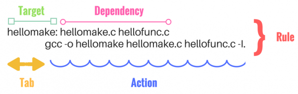

# Learn  MakeFile

# Chạy main.c với folder 1 file .c
```bash
gcc main.c -o main.exe 
cmd: main.exe  
MYNGW64: ./mainexe  
```

# Chạy folder có nhiêu file .c .h
Cách 1: 
```bash
gcc -c main.c  -o main.o
gcc  -c lib.c -o lib.o
gcc main.o lib.o -o main.exe
 ./mainexe  
```
trong đó:  
'-c' là tạo các file object  
'-o' là tạo ra file output  


Cách 2: Gộp các lệnh  ở cách 1 bằng việc dùng '-i'  
```bash
gcc main.c lib.c -o main.exe -I.
 ./mainexe  
```

# Makefile đầu tiên
Tạo 1 file "Makefile"  
```bash
main:
	gcc main.c lib.c -o main.exe -I.
```
Cách chạy   
```bash
make main
```

# Rule MakeFile
\

# Biến trong makeFile
Được khởi tạo:   
```bash
NAME = VALUE
```
Được call:  
```bash
${NAME} hoặc $(NAME) 
```
# Một vài ký tự trong MAKEFILE cần nhớ wildcarrds, automatic variable  
 ## %.o  %.c  pattern đại diện cho file có phần tên bất kỳ, phần mở rộng .c hoặc .o.  
Ví dụ:
```bash
%.o: %.c
	gcc -c $< -o $@
```
Nghĩa là: “Muốn tạo file .o từ file .c có cùng tên phần đầu, chạy lệnh bên dưới”.

## Automatic variables  
```bash
$@: tên của target hiện tại (file đích)  
$<:  tên của file phụ thuộc đầu tiên (first prerequisite)  
$^ — tất cả các file phụ thuộc (all prerequisites), không trùng lặp  
```

Ví dụ minh họa:  

```bash
main.o: main.c
	gcc -c main.c -o main.o
```
Có thể viết ngắn gọn với pattern và automatic variables:  
```bash
%.o: %.c
	gcc -c $< -o $@
```
Ở đây:  
* Nếu target là main.o, thì $@ = main.o  
* File nguồn đầu tiên $< = main.c  


# PHONY
Khi target trung tên file, vd có lệnh:  
```bash
clean:
	rm -f *.exe *.o
```
Và có file 'clean' thì sẽ cho kết quả: 
```bash
make : 'clean' is up to date.
```
ta sẽ sửa makeflie thành:   
```bash
.PHONY: clean
clean:
	rm -f *.exe *.o
```  
Một số chuẩn PHONY hay dùng 
```bash
| Target    | Chức năng                                                      |
|-----------|----------------------------------------------------------------|
| all       | Thực hiện build toàn bộ                                        |
| install   | Tạo bản cài đặt của ứng dụng từ việc compile binary            |
| clean     | Xóa binary file được tạo từ source                             |
| distclean | Xóa tất cả các file được tạo ra mà không nằm trong source chính |
| TAGS      | Tạo bảng tag để editor dùng                                   |
| info      | Tạo GNU info file từ textinfo source                          |
| check     | Chạy bất kỳ test nào tương ứng với chương trình               |
| build     | Biên dịch hoặc xây dựng project               				|
| run	    | Chạy chương trình								             	|
```  